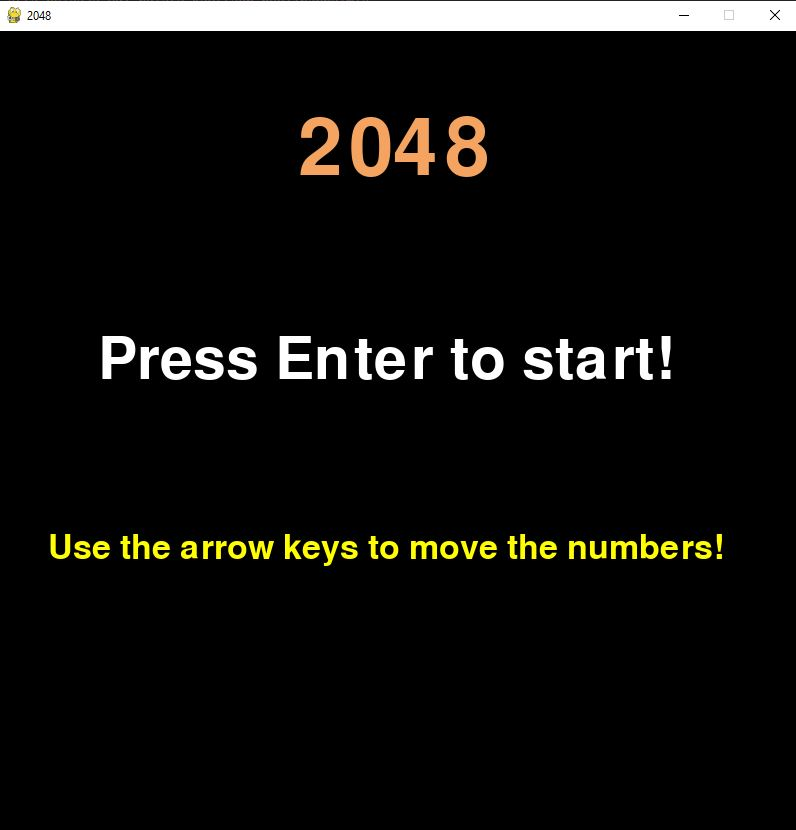
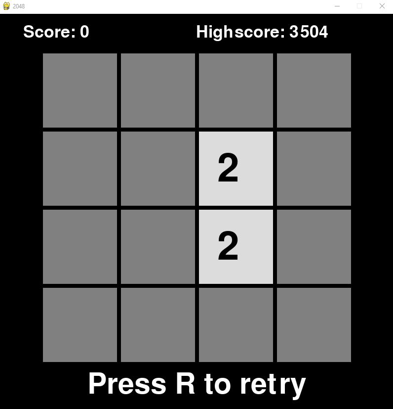

# Käyttöohje

Lataa viimeisimmän releasen lähdekoodi assests-osiosta.

## Asennus ja ohjelman käynnistys

1. Asenna riippuvuudet komennolla:

```bash
poetry install
```

2. Muuta ei tarvitse tehdä. Ohjelman voi käynnistää komennolla:

```bash
poetry run invoke start
```

## Ohjelman käyttö

Käynnistyksen jälkeen avautuu start-menu näkymä joka näyttää seuraavalta:
<br/>


Paina Enter-näppäintä siirtyäksesi pelinäkymään.
<br/>
Pelinäkymä:
<br/>


Käytä nuolinäppäimiä pelataksesi peliä. Kun saavut tilanteeseen, jossa et voi enää siirtää numeroita, voit painaa "r"-näppäintä aloittaaksesi uudelleen. Highscoresi tallennetaan aina, kun saat suuremman scoren kuin edellinen parhaasi. Voit siis sulkea sovelluksen yläkulmasta ja highscoresi on tallessa.

