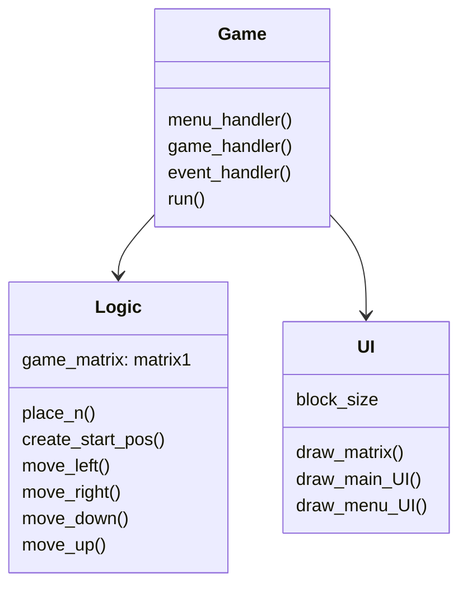

# Arkkitehtuurikuvaus

## Sovelluksen rakenne

Sovelluksessa on 4 pakkausta/kansiota, jotka hoitavat sovelluksen eri toiminnalisuuksia.
 
_logic_ vastaa sovelluslogiikasta, _UI_ käyttöliittymästä, _game_ syötteistä ja pelin pyörittämisestä ja _file_management_ tiedostojen talletuksesta ja hallinnasta.

## Sovelluslogiikka

Sovelluslogiikasta vastaa pääasiassa gamelogic moduuli ja sen luokka logic.
Tämä luokka hoitaa pelimatriisiin liittyvän toiminnallisuuden. Koko 2048-peli perustuu tähän pelimatriisiin ja sen muokkaukseen.

Luokan metodit create_start_pos() ja place_n() mahdollistavat uuden pelin aloituksen. 

Metodi place_n() etsii pelimatriisista tyhjän tilan ja asettaa sinne numeron 2. Tätä metodia käytetään pelin alustuksessa ja jokaisen siirron jälkeen. Metodi create_start_pos() taas alustaa pelimatriisin uutta peliä varten käyttäen place_n() metodia.

Luokan metodit move_n_left(), move_row_left() ja move_left() mahdollistavat pelimatriisin siirrot kaikkiin suuntiin.

Metodi move_n_left() siirtää numeroita vasemmalle, jotta niiden väliin ei jää tyhjiä tiloja.
Metodi move_row_left() yhdistää vierekkäin olevat numerot toisiinsa, jos numerot ovat yhtä suuret.
Metodi move_left() yhdistää edellämainitut metodit ja siirtää matriisin, jokaista riviä oikealla tavalla.

Voimme käyttää tätä move_left() metodia muodostamaan kaikki muut siirtofunktiot käyttäen numpy kirjaston funktiota.

## Käyttöliittymä

Käyttöliittymästä vastaa UI moduuli.

Tämä moduuli vastaa käyttöliittymän ja kaiken muun grafiikan piirtämisestä näytölle.

## Syötteet ja pelin pyöritys

Tämä moduuli hoitaa pygame-eventeistä ja mahdollistaa, että pelaaja voi oikeasti pelata peliä syötteiden avulla. Se myös yhdistää kaikki muut moduulit toimivaksi rakenteeksi. Sen run() funktiota kutsutaan, kun index.py käynnistetään.

## Tiedostojen hallinta

Tiedostojen hallinnasta vastaa file_manager moduuli.

Se on pieni moduuli, joka sisältää tiedostojen hallinta funktioita. Se tekee koodin lukemisesta muissa moduuleissa mielekkäämpää ja mahdollistaa parempaa jatkokehitystä.
 
 
### Koska sovellus on vielä aika yksinkertainen, jokainen moduuli sisältää vain yhden luokan. Jatkokehityksessä voi olla hyödyllistä luoda lisää luokkia.

## Luokkakaavio

## Käyttöliittymä

Pelissä on vain kaksi eri näkymää: start-menu ja varsinainen pelinäkymä. Koska näkymiä on niin vähän ja start-menu on todella yksinkertainen, molemmat näkymät ovat samassa luokassa.
 
 
Ne piirretään näytölle UI-luokan draw_menu_UI() ja draw_main_UI() avulla.
UI-luokka vastaa siis kaikesta käyttöliittymään liittyvästä. Käyttöliittymä on eristetty sovelluslogiikasta kokonaan.
