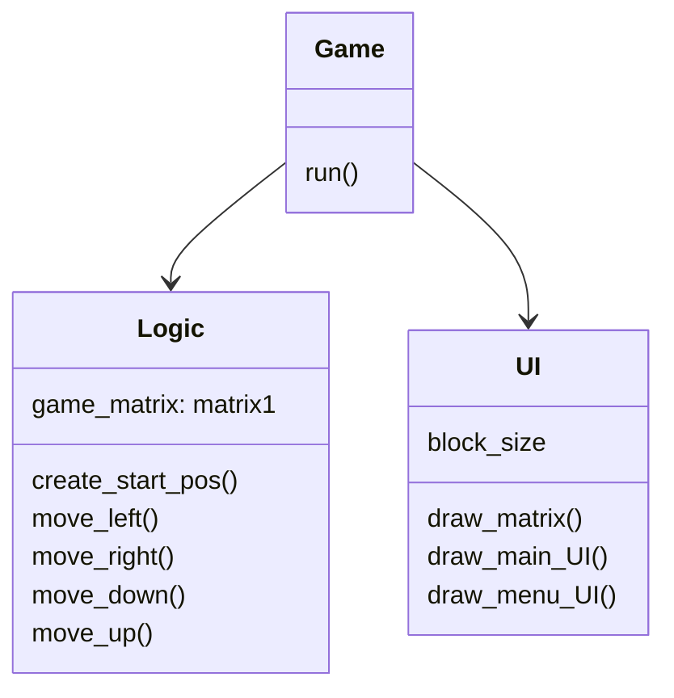

## Luokkakaavio

## Käyttöliittymä

Pelissä on vain kaksi eri näkymää: start-menu ja varsinainen pelinäkymä. Koska näkymiä on niin vähän ja start-menu on todella yksinkertainen, molemmat näkymät ovat samassa luokassa.
 
Ne piirretään näytölle UI-luokan draw_menu_UI() ja draw_main_UI() avulla.
UI-luokka vastaa siis kaikesta käyttöliittymään liittyvästä. Käyttöliittymä on eristetty sovelluslogiikasta kokonaan.
