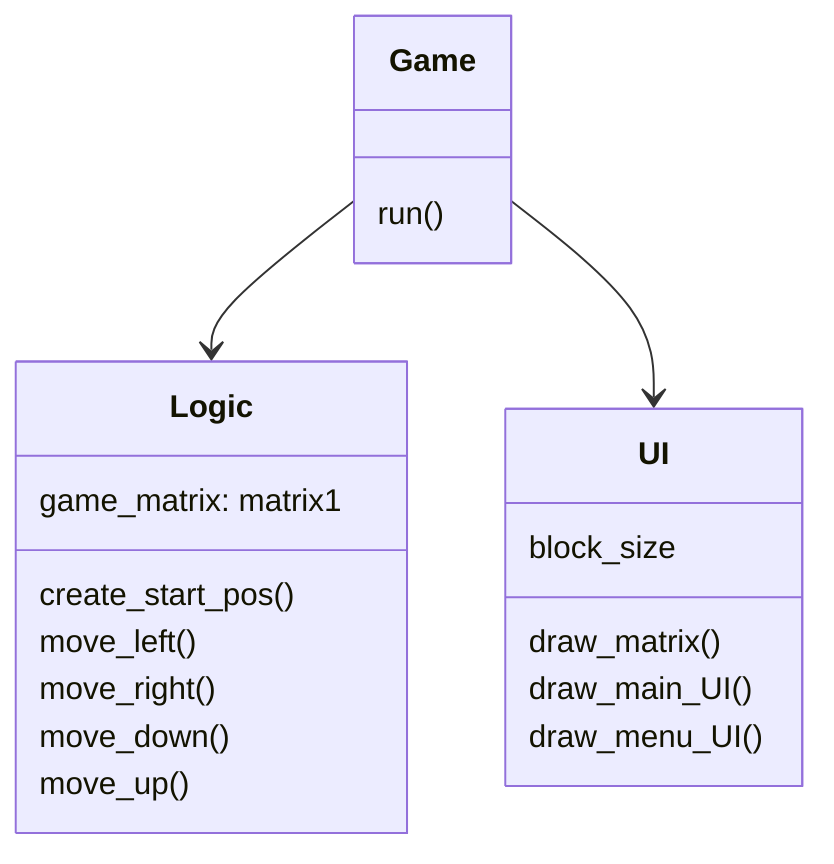

## Sovelluksen rakenne

Sovelluksessa on 4 moduulia: gamelogic, UI, game_main ja file_manager.

### gamelogic

Tämä moduuli hoitaa pelimatriisiin liittyvän toiminnallisuuden. Koko 2048-peli perustuu tähän pelimatriisiin ja sen muokkaukseen.

### UI

Tämä moduuli vastaa käyttöliittymän ja kaiken muun grafiikan piirtämisestä näytölle. Se piirtää pelin 2 näkymää: start-menu ja game-view.

### game_main

Tämä moduuli hoitaa pygame-eventeistä ja mahdollistaa, että pelaaja voi oikeasti pelata peliä syötteiden avulla. Se myös yhdistää kaikki muut moduulit toimivaksi rakenteeksi. Sen run() funktiota kutsutaan, kun index.py käynnistetään.

### file_manager

Pieni moduuli, joka sisältää tiedostojen hallinta funktioita. Tekee koodin lukemisesta muissa moduuleissa mielekkäämpää.
 
 
Koska sovellus on vielä aika yksinkertainen, jokainen moduuli sisältää vain yhden luokan. Jatkokehityksessä voi olla hyödyllistä luoda lisää luokkia.

## Luokkakaavio

## Käyttöliittymä

Pelissä on vain kaksi eri näkymää: start-menu ja varsinainen pelinäkymä. Koska näkymiä on niin vähän ja start-menu on todella yksinkertainen, molemmat näkymät ovat samassa luokassa.
 
 
Ne piirretään näytölle UI-luokan draw_menu_UI() ja draw_main_UI() avulla.
UI-luokka vastaa siis kaikesta käyttöliittymään liittyvästä. Käyttöliittymä on eristetty sovelluslogiikasta kokonaan.
