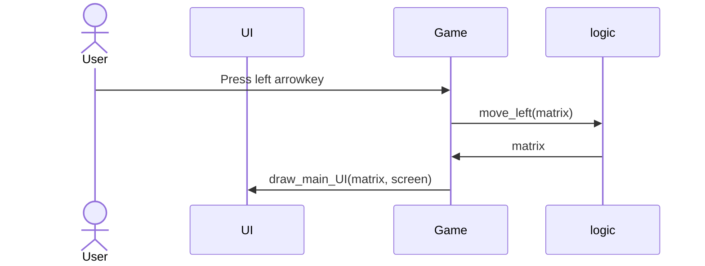
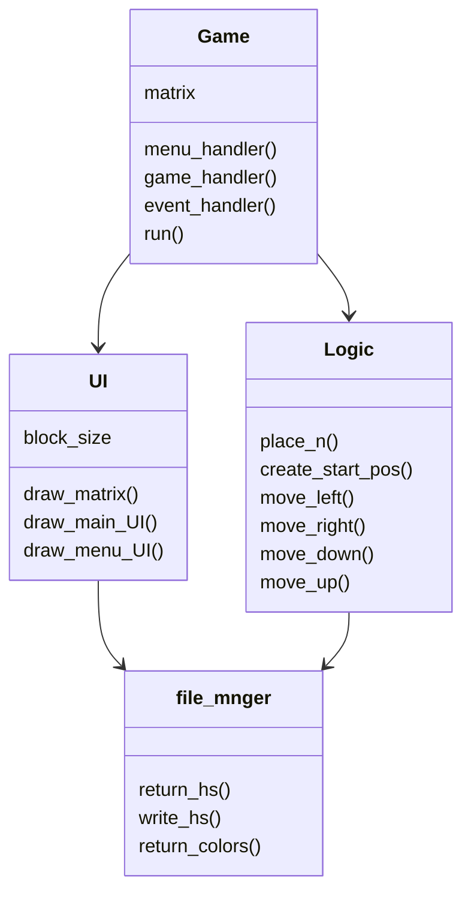

# Arkkitehtuurikuvaus

## Sovelluksen rakenne

Sovelluksessa on 4 pakkausta/kansiota, jotka hoitavat sovelluksen eri toiminnallisuuksia.
 
_logic_ vastaa sovelluslogiikasta, _UI_ käyttöliittymästä, _game_ syötteistä ja pelin pyörittämisestä ja _file_management_ tiedostojen talletuksesta ja hallinnasta.

## Sovelluslogiikka

Sovelluslogiikasta vastaa pääasiassa gamelogic moduuli ja sen luokka logic.
Tämä luokka hoitaa pelimatriisiin liittyvän toiminnallisuuden. Koko 2048-peli perustuu tähän pelimatriisiin ja sen muokkaukseen.

### Luokan metodit create_start_pos() ja place_n() mahdollistavat uuden pelin aloituksen. 

Metodi place_n() etsii pelimatriisista tyhjän tilan ja asettaa sinne numeron 2. Tätä metodia käytetään pelin alustuksessa ja jokaisen siirron jälkeen. Metodi create_start_pos() taas alustaa pelimatriisin uutta peliä varten käyttäen place_n() metodia.

### Luokan metodit move_n_left(), move_row_left() ja move_left() mahdollistavat pelimatriisin siirrot kaikkiin suuntiin.

Metodi move_n_left() siirtää numeroita vasemmalle, jotta niiden väliin ei jää tyhjiä tiloja.
 
Metodi move_row_left() yhdistää vierekkäin olevat numerot toisiinsa, jos numerot ovat yhtä suuret.
 
Metodi move_left() yhdistää edellämainitut metodit ja siirtää matriisin jokaista riviä oikealla tavalla.

Voimme käyttää tätä move_left() metodia muodostamaan kaikki muut siirtofunktiot käyttäen numpy kirjaston funktioita.
 
Pelimatriisi käännetään halutulla tavalla ja sen jälkeen kutsutaan move_left().

## Käyttöliittymä

Käyttöliittymästä vastaa UI moduuli ja sen luokka UI.
 
Tämä moduuli vastaa käyttöliittymän ja kaiken muun grafiikan piirtämisestä näytölle.

Pelissä on vain kaksi eri näkymää: start-menu ja varsinainen pelinäkymä. Koska näkymiä on niin vähän ja start-menu on todella yksinkertainen, molemmat näkymät toteutetaan samassa luokassa.
 
 
Ne piirretään näytölle UI-luokan draw_menu_UI() ja draw_main_UI() metodien avulla.
UI-luokka vastaa siis kaikesta käyttöliittymään liittyvästä. Käyttöliittymä on eristetty sovelluslogiikasta kokonaan. UI-luokka tarvitsee kuitenkin pelimatriisin tiedot, jotta se voidaan piirtää oikein näytölle. Tämän tiedon UI-luokka saa, kun Game-luokka kutsuu UI-luokan metodia draw_main_UI() ja antaa parametriksi pelimatriisin.

Käyttöliittymän ja sovelluksen toimintaa voidaan kuvaa sekvenssikaaviolla:

  

## Syötteet ja pelin pyöritys

game_main moduuli ja sen luokka Game hoitavat pygame-eventeistä ja mahdollistavat, että pelaaja voi oikeasti pelata peliä syötteiden avulla.
 
 
Luokassa hoidetaan pygame-eventtien tarkistus ja päivitetään pygamen ruutu. Tarkastuksien ja ruudun päivityksen taajuudesta vastaa pygamen pygame.time.Clock(). Sen avulla päivitystaajuudeksi on asetettu 60hz. Pelin grafiikoiden framerate on siis 60fps. Tämä myös varmistaa, että peli pyörii tasaisesti ja vastaa nopeasti pelaajan syötteisiin.

Game-luokka myös yhdistää kaikki muut moduulit toimivaksi rakenteeksi. Sen run() funktiota kutsutaan, kun sovellus käynnistetään.

## Tiedostojen hallinta

Tiedostojen hallinnasta vastaa file_manager moduuli.

Se on pieni moduuli ja luokka, joka sisältää tiedostojen hallinta metodeja. Se tekee koodin lukemisesta muissa moduuleissa mielekkäämpää ja mahdollistaa parempaa jatkokehitystä.
 
 
### Koska sovellus on vielä aika yksinkertainen, jokainen moduuli sisältää vain yhden luokan. Jatkokehityksessä voi olla hyödyllistä luoda lisää luokkia.

## Sovelluksen luokkien suhteita kuvaa Luokkakaavio:

