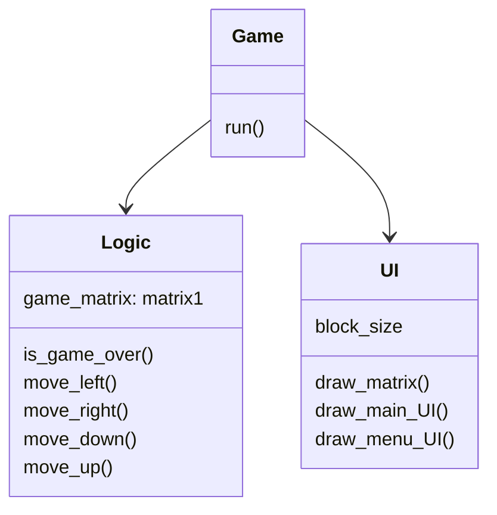

## Luokkakaavio

```mermaid

  classDiagram
  
  Game --> Logic
  Game --> UI
  
  class Game{
     run()
  }
  
  class Logic{
    game_matrix: matrix1
    
    is_game_over()
    move_left()
    move_right()
    move_down()
    move_up()
  }
  
  class UI{
    block_size
    draw_matrix()
    draw_main_UI()
    draw_menu_UI()
  }

```
