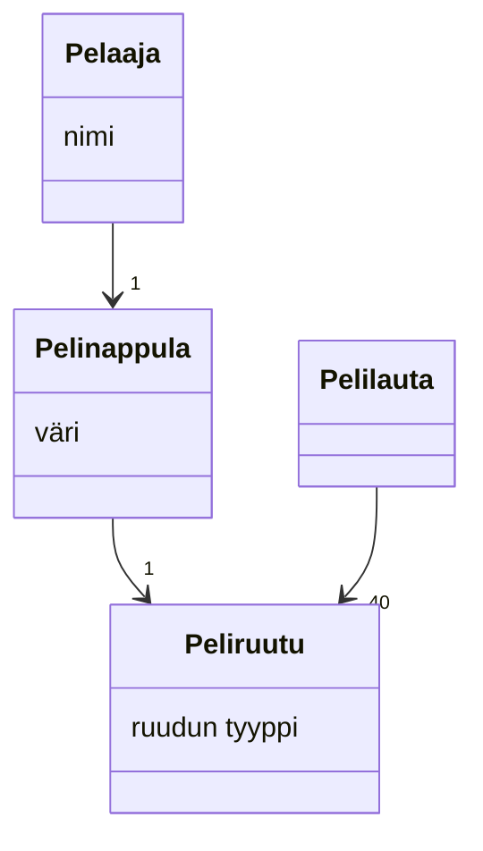

```mermaid

  classDiagram
  
  Pelaaja --> "1" Pelinappula
  Pelinappula --> "1" Peliruutu
  Pelilauta --> "40" Peliruutu
    
    class Pelaaja{
      nimi
    }
    
    class Pelinappula{
      väri
    }
    
    class Pelilauta{
    
    }
    
    class Peliruutu{
      ruudun tyyppi
    }

```
