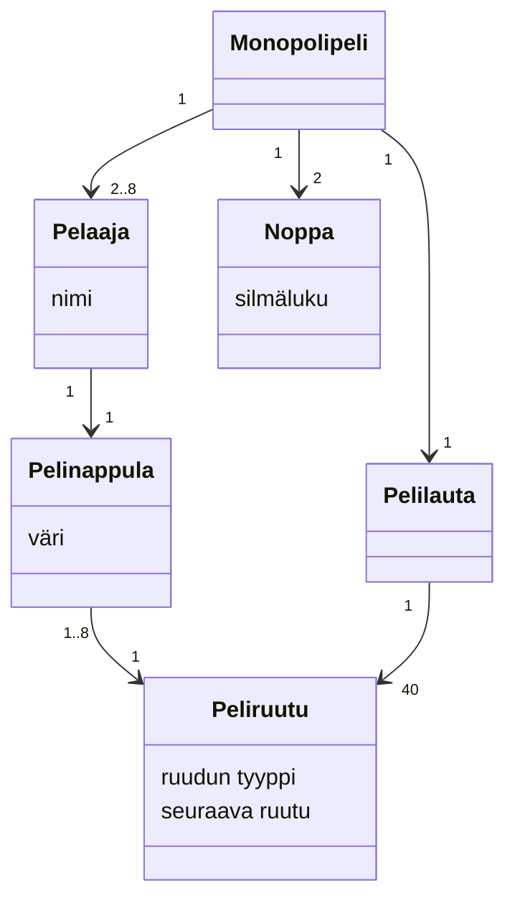

```mermaid

  classDiagram
  
  Pelaaja "1" --> "1" Pelinappula
  Pelinappula "1..8" --> "1" Peliruutu
  Pelilauta "1" --> "40" Peliruutu
  Monopolipeli "1" --> "2" Noppa
  Monopolipeli "1" --> "1" Pelilauta
  Monopolipeli "1" --> "2..8" Pelaaja
  
    class Monopolipeli{
      
    }
    
    class Pelaaja{
      nimi
    }
    
    class Pelinappula{
      väri
    }
    
    class Pelilauta{
    
    }
    
    class Peliruutu{
      ruudun tyyppi
      seuraava ruutu
    }
    
    class Noppa{
      silmäluku
    }

```
