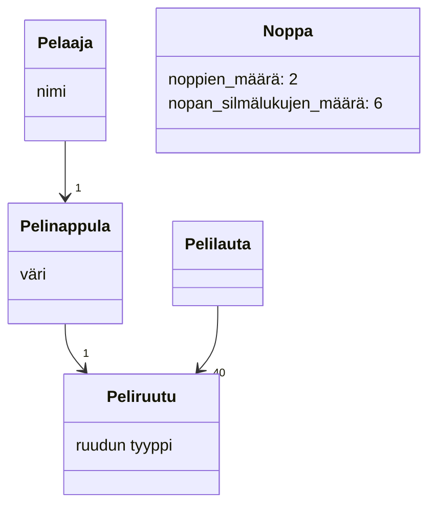

```mermaid

  classDiagram
  
  Pelaaja --> "1" Pelinappula
  Pelinappula --> "1" Peliruutu
  Pelilauta --> "40" Peliruutu
    
    class Pelaaja{
      nimi
    }
    
    class Pelinappula{
      väri
    }
    
    class Pelilauta{
    
    }
    
    class Peliruutu{
      ruudun tyyppi
    }
    
    class Noppa{
      noppien_määrä: 2
      nopan_silmälukujen_määrä: 6
    }

```
